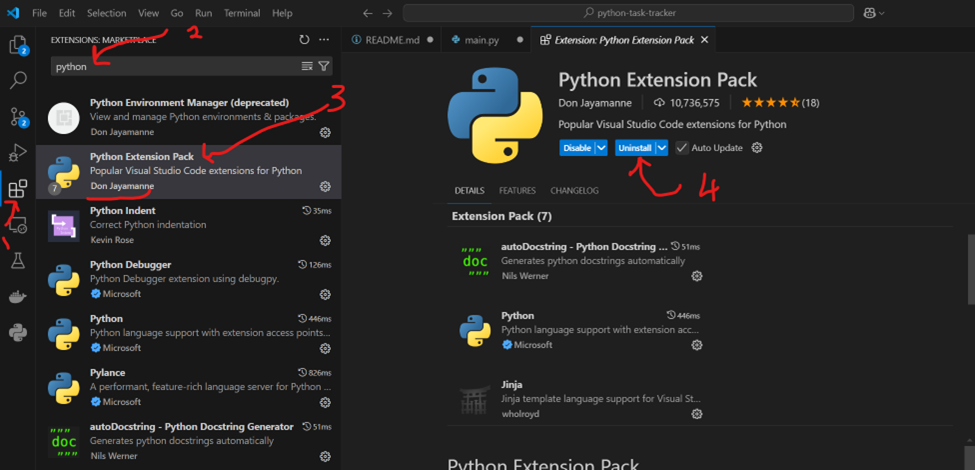
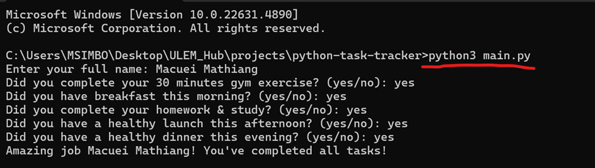
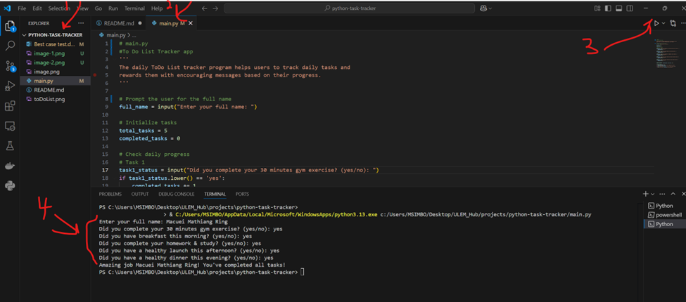
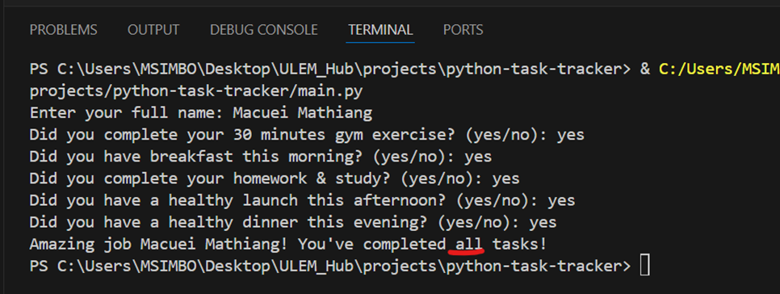
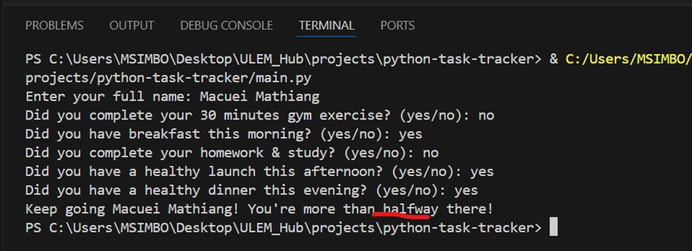
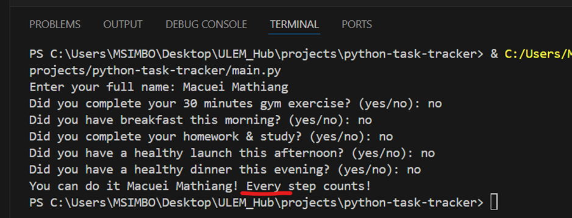

# Python Task Tracker application

Project Description

The daily ToDo List tracker program helps users to track daily tasks and rewards them with encouraging messages based on their progress.

## Table of Contents
- [Python Task Tracker application](#python-task-tracker-application)
  - [Table of Contents](#table-of-contents)
  - [Features](#features)
  - [Getting Started](#getting-started)
    - [Prerequisites](#prerequisites)
    - [Installation](#installation)
  - [Usage](#usage)
  - [Contributing - individual project](#contributing---individual-project)
  - [Testing](#testing)
- [Testing condition where all scheduled tasks are done.](#testing-condition-where-all-scheduled-tasks-are-done)
- [Testing condition where half of the scheduled tasks are done.](#testing-condition-where-half-of-the-scheduled-tasks-are-done)
- [Testing condition where all scheduled tasks are done.](#testing-condition-where-all-scheduled-tasks-are-done-1)
  - [Deployment](#deployment)
  - [Built With](#built-with)
  - [License](#license)
  - [Acknowledgments](#acknowledgments)

## Features
- Request the user to input their complete name for identification purposes. 
- Monitor and record the advancement of tasks that have been scheduled. 
- Evaluate the completion status of predefined tasks within the system. 
- Determine the percentage of completed tasks relative to the total number of tasks. 
- Present motivational messages to users based on their current task completion status

## Getting Started
To develop, test/debug, and run python applications locally, you will install
VS Code IDE, and Python program

### Prerequisites
- Python Program
- Microsoft VS Code IDE (Integrated Development Environment)
- Python Extension Pack

### Installation
1. Download and Install Python Program:
  https://www.python.org/downloads/

2. Download and Install Microsoft VS Code
   https://code.visualstudio.com/download

3. Install Python Extension Pack inside your VS Code:
   Follow the following 4 steps to install Python Extension Pack by Don Jayamanne
   
   
 

## Usage
The python task tracker application can be run either using Command Line Interface (CLI) or VS Code IDE terminal. It is an interactive application where user's responoses are expected.

  I) Run the application on command line:
- $ python main.py
  
  

II) Run the application on VS Code IDE  (GUI):

## Contributing - individual project
Purpose: learning git common features
- Used SSH to link both local git repo to remote GitHub accoutn
- Create a new repository on github called python-task-tracker

1. Clone the Project ('git clone git@github.com:macdit3/python-task-tracker.git')
2. Open command Line interface (cmd) inside python-task-tracker ('code .') to open the project in VS Code IDE
3. Check status of the current project directory ('git status  ')
4. Commit your Changes (`git commit -m 'adding new changes to local git'`)
5. Push changes to remote repo (`git push git@github.com:macdit3/python-task-tracker.git`)

## Testing
Testing the 3 required conditions:
# Testing condition where all scheduled tasks are done.

# Testing condition where half of the scheduled tasks are done.
 

# Testing condition where all scheduled tasks are done.

## Deployment
The application will be deployed online for live online to public

## Built With
* In this project, non of the Python Framework in used to built this temrinal app
* In the future, one of the Python Framework will be used with additional features.

## License
This project is considered to be open source to anyone to use.

## Acknowledgments
*  Created by Mr. Macuei Mathiang 
* This project is part of the MA Workforce IT Development Trianing 
* Date 02/23/2025
